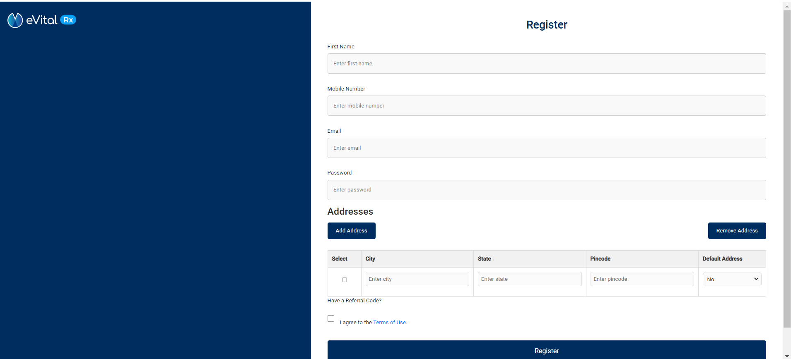
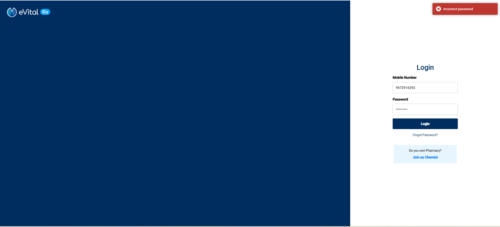
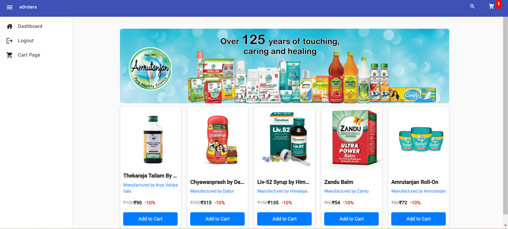
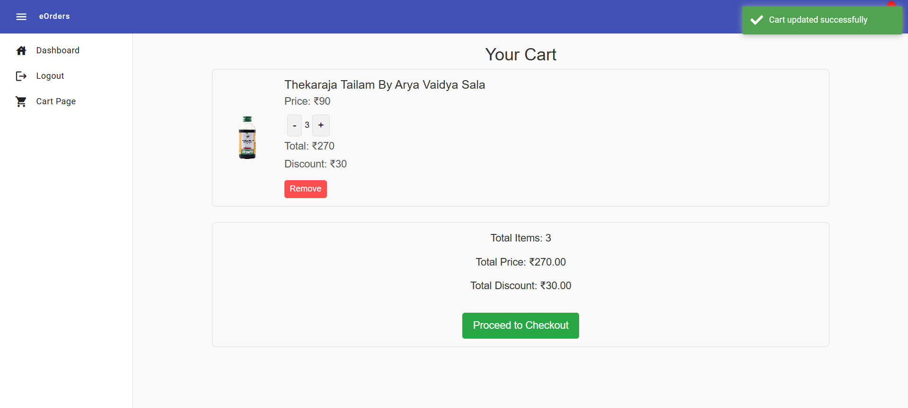
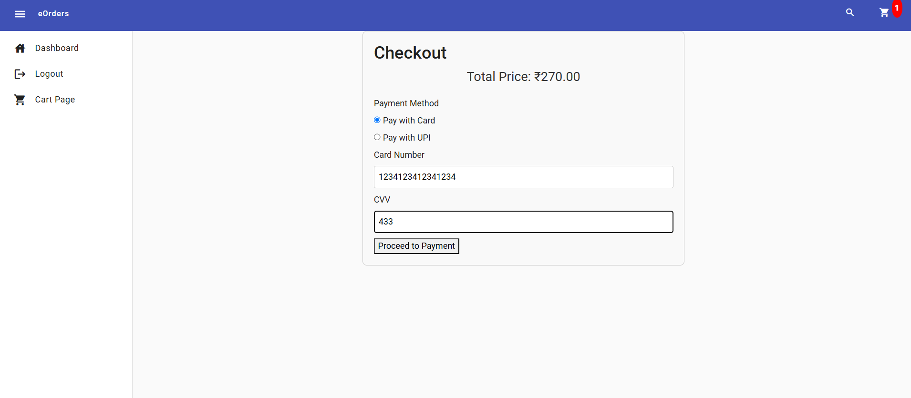
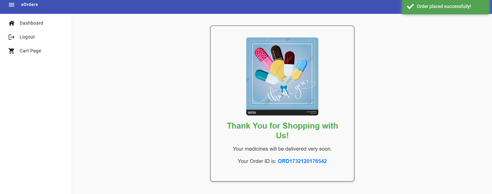
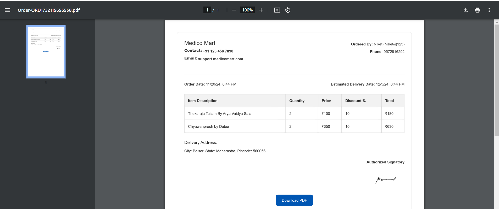

# EvitalRx

This project was generated with [Angular CLI](https://github.com/angular/angular-cli) version 17.3.8.

## Development server

Run `ng serve` for a dev server. Navigate to `http://localhost:4200/`. The application will automatically reload if you change any of the source files.
Run `json-server --watch db.json` to run json server

## Code scaffolding

Run `ng generate component component-name` to generate a new component. You can also use `ng generate directive|pipe|service|class|guard|interface|enum|module`.

## Build

Run `ng build` to build the project. The build artifacts will be stored in the `dist/` directory.

## Running unit tests

Run `ng test` to execute the unit tests via [Karma](https://karma-runner.github.io).

## Running end-to-end tests

Run `ng e2e` to execute the end-to-end tests via a platform of your choice. To use this command, you need to first add a package that implements end-to-end testing capabilities.

## Further help

To get more help on the Angular CLI use `ng help` or go check out the [Angular CLI Overview and Command Reference](https://angular.io/cli) page.

# MedicalMart

**Signup page Description**:  
The Signup page is a registration form that allows users to create an account. It includes fields for First Name, Mobile Number, Email, Password, and multiple Address entries.

- **Form Validation**: Ensures that all required fields are filled and correctly formatted (e.g., valid email, mobile number, password strength).
- **Dynamic Address Management**: Users can add or remove addresses, with one address being marked as default.
- **Referral Code**: Optional field for entering a referral code.
- **Terms Agreement**: Users must agree to the Terms of Service before submitting the form.
- **Form Submission**: Validates the form and checks if the mobile number already exists. If valid, it submits the data to the backend API for registration.

# **MedicalMart**

**Login Page Description**:  
The Login page allows users to sign in to their accounts using their mobile number and password. The page includes a form with fields for entering credentials, validation, and password visibility toggle.

### Features:
- **Form Validation**: Ensures that both mobile number and password fields are filled correctly, displaying error messages if the fields are empty or incorrectly formatted.
  - Mobile number must be a valid 10-digit number.
  - Password must have a minimum length of 6 characters.
- **Password Visibility**: Users can toggle the visibility of the password field to view or hide their password.
- **Forgot Password**: A link is provided for users who have forgotten their password, redirecting them to the password recovery page.
- **Login Button**: Once the form is valid, users can submit their credentials. The page checks if the user exists and if the password matches.
- **Chemist Registration**: An option for pharmacy owners to join as chemists by navigating to the signup page.

**Form Submission**:  
Upon submitting the form, the credentials are validated. If the login is successful:
- A success message is shown, and user details are stored in local storage.
- User's cart data is loaded and updated on the page. The user is then redirected to the homepage.

If the user is not found or the password is incorrect, appropriate error messages are displayed.
# **MedicalMart**

## **Landing Page**

**Landing Page Description**:  
The landing page serves as the entry point for users, featuring a dynamic carousel showcasing different product banners and an organized product listing. The page displays an array of products with images, names, manufacturers, prices, and discounts. It includes an option to add products to the cart and links to view more details.

### Features:
- **Product Carousel**:  
  Displays a sliding carousel with images of featured products or promotions.
- **Product List**:  
  Displays a list of available products with the following details: 
  - Product Name
  - Manufacturer (with a link to the manufacturer's page)
  - Product Price (including MRP, final price, and discount percentage)
- **Add to Cart**:  
  Each product has an "Add to Cart" button. Users can add products to their cart by clicking this button.
- **Loading State**:  
  A loading message is shown if products are still being fetched from the backend.
- **Cart Functionality**:  
  Users can add products to their cart, provided they are logged in. If the user is not logged in, a prompt will ask them to log in to proceed.

---

## **Dashboard Page**

**Dashboard Page Description**:  
The dashboard page is the user's main interface once logged in. It includes a product carousel at the top, followed by a grid of products that the user can browse and add to their cart. It also integrates cart functionality and displays user-specific data.

### Features:
- **Product Carousel**:  
  A responsive carousel that showcases products or offers.
- **User Data Fetching**:  
  The page fetches and displays user-specific data, such as the user's cart items and account details.
- **Product Listing**:  
  Displays products from the backend with details like product image, name, manufacturer, price, and discount.
- **Add to Cart**:  
  Users can add products to their cart. If a product is already in the cart, a message will notify them.
- **User Authentication**:  
  Ensures that users are logged in before they can add products to the cart. If a user isn't logged in, they will be prompted to log in.
- **Cart Update**:  
  Upon adding a product to the cart, the cart count is updated, and the cart is synchronized with the backend.

  ## **Cart Page**

**Cart Page Description**:  
The Cart Page allows users to view and manage the products they have added to their cart. Users can adjust quantities, remove items, and proceed to checkout. The page also provides a summary of the cart, including the total price, total discount, and number of items in the cart.

### Features:
- **View Cart Products**:  
  Displays all the products currently in the cart, including the product image, name, price, quantity, and total cost for each item.
- **Quantity Management**:  
  Users can increase or decrease the quantity of each product in the cart. The page recalculates the total price and discount whenever quantities are adjusted.
- **Product Removal**:  
  Users can remove a product from the cart. Upon removal, the cart is updated, and the total price, discount, and item count are recalculated.
- **Cart Summary**:  
  Displays the total number of items in the cart, total price, and total discount. This information is dynamically updated as products are added or removed.
- **Checkout Button**:  
  If the cart contains products, users can proceed to the checkout page. If the cart is empty, a message will prompt the user to add products.
- **Navigation to Products**:  
  Users can navigate back to the product listing page by clicking the “Go to Products” button when the cart is empty.

## **Checkout Page**

**Checkout Page Description**:  
The Checkout Page allows users to review their cart, select a payment method, and complete their purchase securely. It provides a dynamic and responsive interface, adjusting based on the payment method selected by the user.

### **Features**:

1. **Total Price Display**:  
   Displays the total price of the items in the cart, formatted to two decimal places, for clear and accurate cost information.

2. **Payment Method Selection**:  
   Users can select between two payment methods:
   - **Pay with Card**: Users can enter their credit or debit card details.
   - **Pay with UPI**: Users can enter their UPI ID for payment.
   
   The form dynamically displays the relevant input fields based on the selected payment method (Card or UPI), making the process seamless.

3. **Card Payment Details (Conditional)**:  
   If the **Pay with Card** option is selected, the following fields are shown:
   - **Card Number**: A field to enter the 16-digit card number.
   - **CVV**: A field to enter the 3-digit CVV code from the back of the card.
   
   Both fields are validated to ensure that the card number and CVV code are in the correct format. If the input is invalid, error messages will be displayed.

4. **UPI Payment Details (Conditional)**:  
   If the **Pay with UPI** option is selected, the following field is shown:
   - **UPI ID**: A field to enter the UPI ID.
   
   The UPI ID input is validated to ensure that it follows the correct format, ensuring a smooth transaction process.

5. **Submit Button**:  
   A **Submit** button is included to trigger the payment process. The button is initially disabled and only becomes active once all required fields
    have been filled with valid data, ensuring that users cannot proceed with incomplete or incorrect information.

## **Thank You Page**

**Thank You Page Description**:  
This page is displayed to users after they have completed their order. It shows a confirmation message and provides essential details about the order,
 including the order ID. This page ensures that users know their purchase was successful and that their order is being processed.

## **Order List Component**

The **Order List Component** allows users to view their past orders in a detailed format and download the invoice as a PDF.

### **Features**:

1. **Pharmacy and User Information**:
   - Displays pharmacy details (name, contact number, email).
   - Shows the user’s name, phone number, and email.

2. **Order Details**:
   - Shows the **order date** and **estimated delivery date** (calculated by adding 15 days to the order date).
   - Lists **ordered products** with name, quantity, price, discount, and total price for each item.

3. **Delivery Address**:
   - Displays the **delivery address** where the order will be shipped (city, state, pincode).

4. **Authorized Signatory**:
   - Displays an **authorized signatory** with an image of the signature.

5. **Download PDF**:
   - Allows users to **download the order as a PDF**.
   - Captures the HTML content of the order using **html2canvas** and generates a PDF using **jsPDF**.
   - Saves the PDF with the order ID in the filename.